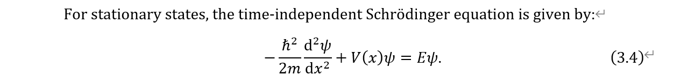

<h1> Tex2docx </h1>

This is a guide of using "pandoc+panflute" to convert latex file to docx format.

<h2> Content </h2>

- [Some basic questions](#some-basic-questions)

    - [Why do you want to convert latex to docx](#q-why-do-you-want-to-convert-latex-to-docx)

    - [What is pandoc and panflute](#q-what-is-pandoc-and-panflute)

    - [How does the conversion work](#q-how-does-the-conversion-work)

    - [What is the restriction of this conversion code](#q-what-is-the-restriction-of-this-conversion-code)

- [Demo of work flow](#demo-of-work-flow)

    - [Configuration](#configuration)

    - [Plain pandoc](#plain-pandoc)

    - [Filter design](#filter-design)


-------------------------------------------------------------------------------

# Some basic questions

## Q: Why do you want to convert latex to docx

LaTeX is a typesetting system commonly used in academia and scientific fields, while Microsoft Word is a widely used word processing software. LaTeX can be considered a specialized programming language, offering advanced features and specific commands that may not be fully supported by Pandoc, a tool used for document conversion.

It's important to note that while Pandoc can convert LaTeX to DOCX, **the conversion is not always be perfect**, as the two formats have different capabilities and features. Manual adjustments or fine-tuning may be required after the conversion to ensure the document appears as intended in the new format.

The goal of this repository is to **showcase the workflow of Customized Pandoc**, a tailored version of Pandoc that aims to minimize the need for manual adjustments. 

**Attention: Make sure whether it is necessary to convert the latex file into docx format before you start the procedure.** 

-------------------------------------------------------------------------------

## Q: What is pandoc and panflute

[Pandoc](https://pandoc.org/) is a versatile command-line tool and a document conversion library that allows you to convert files from one markup format to another. It supports a wide range of input and output formats, including Markdown, HTML, LaTeX, PDF, EPUB, DOCX, and many others.

With Pandoc, you can easily convert documents between different formats without having to manually rewrite or reformat the content. It provides a flexible and powerful way to automate document conversions and transform your files into various formats suitable for different purposes.

Pandoc is an open-source project and is available for Windows, macOS, and Linux. You can use it from the command line or integrate it into your own applications or workflows using its library API.

[Panflute](https://scorreia.com/software/panflute/) is a Python package that provides some convenience when writing Pandoc filters.

-------------------------------------------------------------------------------

## Q: How does the conversion work

Pandoc follows a modular architecture that separates the parsing, transformation, and rendering stages, allowing for flexibility and extensibility.

$$ \text{input document} \rightarrow \text{abstract syntax tree (AST)} \xrightarrow{\text{user-defined filter}} \text{new AST} \rightarrow \text{output document} $$

Pandoc works by parsing the input document, which can be written in various markup formats such as Markdown, HTML, LaTeX, or even word processing formats like DOCX. It then transforms the parsed document into an **abstract syntax tree (AST)**, which represents the structure and content of the document in a standardized format.

While Pandoc takes care of the conversion between documents and AST, which gives the basic performance, to achieve better output, we have to design custumized filter. In principle, you can manage the AST totally by yourself with only an interface with Pandoc, but it could be a tedious work. **Thus, here we utilize a Python package called Panflute to simplify the design process of the custumized filter.** 

-----------------------------------------------------------------------------

## Q: What is the restriction of this conversion code

- This is only a demo
    
    The conversion procedure has strong connection to the commands used in your latex code, some commands have to be considered one by one. You may need to design some more filters to handle the problems you meet based on the AST file, which could be carried on in the same manner as what we have done.

    For those formats used for heading, equation numbers, etc, you can fix them to match your demand. For example, you can change the equation number format from "(section.equation)" to "(equation)". We have added prefix `FIXME` in the comment lines of the python file to help you find out the locations of these formats.

    Not every latex command is considered here. For example, in this repository we only consider `\ref`, `\eqref` and `\label` command for cross reference. Other latex command is not supported. But you can always extend this range of the latex commands being implemented by yourself.  

- Do not use commands that pandoc can not handle

    For exmaple, `\begin{figure*} \end{figure*}` could not be understood by pandoc and you should change it into `\begin{figure} \end{figure}`.

- Most of the layout design and setting will be destory during the conversion

    Some manually setting in docx file may be necessary. You'd better understand some layout setting methods of docx.

- Be careful with the line break and indentation of paragraph in docx

    Pandoc doesn't know that after a latex environment such as `equation`, `enumerate`, whether it should start a new paragrah or not. And in fact it starts a new paragraph in all circumstances. This phenomenon leads to a difference if the paragraghs are required to start with an indent. You may need to manually fix this issue in the docx file or write a more careful filter function to add indent for each paragraph.

------------------------------------------------------------------------------------

# Demo of work flow

## Configuration

In this guide we use

- pandoc 3.1.13

- python 3.10.13

- panflute 2.3.1

Note: The code may get wrong under different configurations.


## Plain pandoc
 
``` sh
pandoc "$input_file" --from latex --to docx \
    --citeproc --bibliography "$bibliography_file" \
    --resource-path "$figures_dir" \
    -o "$output_file"
```

This is the basic command of pandoc to convert latex into docx. Remember to provide the path of the necessary files. It is easy to see that there are many problems in the output docx file.

**Add template docx file**

One can provide a custumized docx file as a template to guide the conversion process of pandoc by the command below:
``` sh
pandoc "$input_file" --from latex --to docx \
    --citeproc --bibliography "$bibliography_file" \
    --resource-path "$figures_dir" \
    --reference-doc "$template_docx_file"
    -o "$output_file"
```
We emphasize that you have to carefully design the template docx file by explicitly assigning the style of each type of text to achieve the desired performance. **However, this process is not controllable and it could get wrong even you design the template carefully.**

**Specify reference style**

There are many different styles of the items in the reference section. You can specify the style that pandoc used by providing the CSL (Citation Style Language) file:
``` sh
pandoc "$input_file" --from latex --to docx \
    --citeproc --bibliography "$bibliography_file" --csl "$reference_style" \
    --resource-path "$figures_dir" \
    -o "$output_file"
```
You could write your own CLS file following the instruction of [CSL](https://citationstyles.org/). You can also search for the required CLS file that you need. Below are some helpful website providing such templates (Some of them may not work directly and you need to make some modification). 

- [English styles](https://github.com/citation-style-language/styles)

- [Chinese styles](https://github.com/redleafnew/Chinese-STD-GB-T-7714-related-csl#readme)

------------------------------------------------------------------------------------------------------


## Filter design

With the specific filters defined in python file, we expand the conversion command of pandoc as: 
``` sh
pandoc "$input_file" --from latex+raw_tex --to docx \
    --citeproc --bibliography "$bibliography_file" \
    --resource-path "$figures_dir" \
    -F "$filter_script" \
    -o "$output_file"
```

To add custumized filter to the conversion of pandoc, we have to get into the internal with abstract syntax tree (AST). AST is a general representation on which pandoc operates. The reader component will convert the input form to the corresponding AST format. And the writer component of pandoc does not know about the input form, it works on AST directly. This allows pandoc to make conversion between different forms.

Pandoc can output the internal AST temporarily to a JSON file, and we further use python to refactor the JSON file to make it human readable. The bash command goes like: 
``` sh
pandoc "$input_file" --from latex+raw_tex \
    --citeproc --bibliography "$bibliography_file" \
    -o AST.json
python3 -m json.tool AST.json > formatted_AST.json
```

**NOTE: input format `latex+raw_tex` means that to keep all the latex commands that pandoc doesn't understand unchanged in the AST. This option is necessary for those filters later.**

For example, you will something like this in the formatted JSON file of AST:
``` json
"abstract": {
    "t": "MetaBlocks",
    "c": [
        {
            "t": "Para",
            "c": [
                {
                    "t": "Str",
                    "c": "Your"
                },
                {
                    "t": "Space"
                },
                {
                    "t": "Str",
                    "c": "abstract."
                }
            ]
        }
    ]
},
```

To modify some of the elements in the JSON file, we utilize functions from python package Panflute. Each leaves (and the root) of the abstract syntax tree (AST) is an instance of the base class of panflute called `Elemenet`. And a standard filter of panflute looks like:
``` py
import panflute as pf
def filter_name(elem: pf.Element, doc: pf.Doc):
    # action of the filter
```
When we call this filter function, it will automatically run through every `Element` instances in the AST JSON file to perform the desired action, which simplify the coding process in some extent.


**REMARK:** if you want to print some info in the filter function of panflute, you should do it in a manner like
``` py
print('text', file=sys.stderr)
```

-------------------------------------------------------------------------------------------------------

### Headers

Plain pandoc will not add section number for each header since they actually not appear in the latex file. Thus, we have to compute the section number for the headers in format "1.1.1 Header text". You can also change it to any other type of the headers. To achieve this, we introduce a stack to manage the serial numbers in different section levels. Then we can fix the text of the original header by appending the section numbers.

Besides, plain pandoc will not add the heading of the reference section. Thus we have to write a filter to add the heading of reference in format "References".


### Figures and tables

Figures in PDF format is not acceptable in pandoc. You have to convert them into PNG or JPEG format in advanced.

Both figures and tables are floats in latex file without serial numbers. We utilize some global dictinoaries to store their serial number and then add the serial numbers to their captions like "Figure 1: Caption". You can change the format to another type you want.

We remark that the setting of latex environments for figure and table can not be understood by pandoc and the convesion of figure (table) setting in AST to docx file is also not supported. Thus, you have to  resize the figures and fix the style setting of figure and tables in docx file manually if necessary. 


### Math equations

Plain pandoc can not manage the label and cross reference of equations. Thus, we will number those equations with labels in format "(section.equation)" and resolve their reference.

We emphasize that only those labeled equation will be numbered, if you want to number all the equations even if some of them not being labeled, you need to fix some code by yourself.

To add equation number in docx format, you have to add the number with a `#` at the end of the latex command for the equation in AST like,
``` tex
-\\frac{\\hbar^2}{2m} \\frac{\\mathrm{d}^2 \\psi}{\\mathrm{d}x^2} + V(x)\\psi = E\\psi  #(3.4)
```
After conversion, you will probably see the equation in docx file like:


To obtain a normal label style, you only need to open the drop-down menu of any equation and select the `Professional` option, i.e.,


Then you will get something like this:



**NOTE: You can choose the `All-Professional` option to make all equations in professional style at once.**


### Cross reference

Plain pandoc can not handle the `\ref` or `\eqref` command in latex to give the correct serial number. Hence we have to define a filter function to replace the original labels to their serial numbers. Note that we have extracted the serial numbers of headers, figures, tables and equations and saved them in corresponding python dictionaries. Now we only need to find out those labels being referred and replaced them based on their types and labels. 

The cross reference of equations uses `eqref` command, which is different with the `\ref` command for headers, figures, etc. Thus, we separate them into different functions. We highlight that for different types of environments not including, you should write another filter function for them. Here we only give the example for Theorem environment, if you use Lemma environment, you should add a function to number the lemmas and resolve the cross reference.


### Indentation

Indentation is not necessary when writting documents. Pandoc will not add indent for each paragragh in the content. But we still provide an option to add indent before the first line of each paragragh. You should turn on the switch in the python code, i.e., `is_paragragh_with_indent = True`.

There are different setting of the length of the indentation. You can change the indent in the filter function to any format you want. 

But we emphasize that pandoc can not handle the line break and start of new paragragh perfectly. You may still need some manual adjustment after the conversion.


### Others ...

You could add any other filter to fix your problems and achieve a better output, but some mannual modification in docx file may not be avoided.